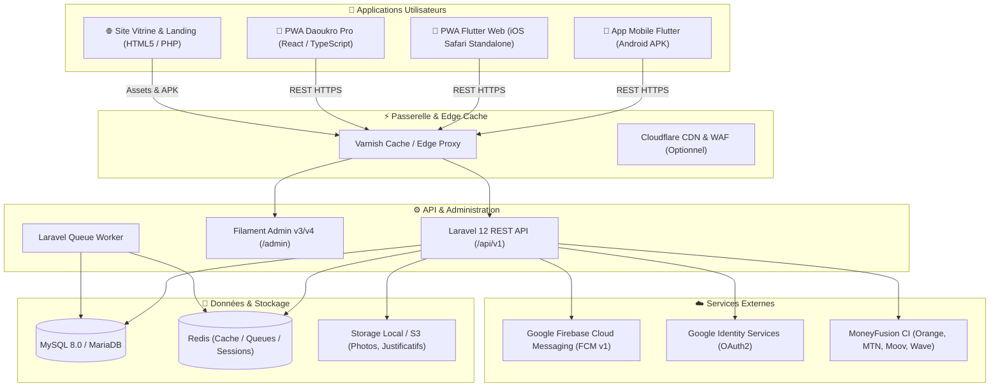
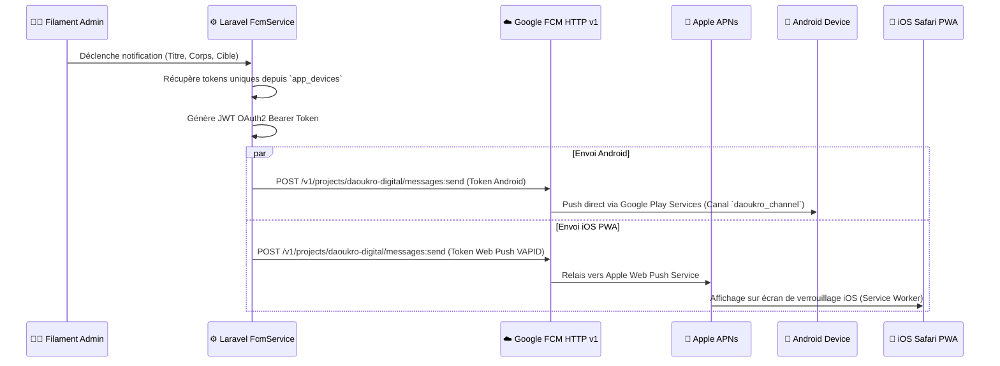

# 🏛️ Documentation Technique & Architecture Globale — Écosystème Daoukro Digital

> **Document de référence pour l'ingénierie, l'exploitation, la scalabilité, la conteneurisation et le CI/CD.**  
> *Projet : Daoukro Digital & Daoukro Pro · AKDEV · Version 1.1.0*

---

## 📑 Sommaire

1. [Vue d'Ensemble de l'Écosystème](#1-vue-densemble-de-lécosystème)
2. [Stack Technologique Détaillée](#2-stack-technologique-détaillée)
3. [Architecture Système & Flux de Données](#3-architecture-système--flux-de-données)
4. [Sécurité & Authentification Hybride](#4-sécurité--authentification-hybride)
5. [Système de Notifications Push (FCM v1 & Web Push VAPID)](#5-système-de-notifications-push-fcm-v1--web-push-vapid)
6. [Monétisation & Paiements Mobile Money (MoneyFusion)](#6-monétisation--paiements-mobile-money-moneyfusion)
7. [Stratégie de Montée en Charge (High Load & Scalabilité)](#7-stratégie-de-montée-en-charge-high-load--scalabilité)
8. [Guide de Conteneurisation Docker Clé en Main](#8-guide-de-conteneurisation-docker-clé-en-main)
9. [Pipeline CI/CD (GitHub Actions)](#9-pipeline-cicd-github-actions)
10. [Plan de Maintenance, Sauvegardes & Roadmap d'Évolution](#10-plan-de-maintenance-sauvegardes--roadmap-dévolution)

---

## 1. Vue d'Ensemble de l'Écosystème

L'écosystème **Daoukro Digital** est une plateforme omnicanale dédiée aux services municipaux, citoyens, professionnels et touristiques de la commune de Daoukro.



### Répartition des 4 projets du workspace :
1. **`daoukro-api`** : Cœur applicatif en Laravel 12 avec panneau d'administration Filament, base de données, API REST v1, moteur FCM v1 et webhooks MoneyFusion.
2. **`daoukro-user-main`** : Application Flutter multiplateforme (Android APK natif + Flutter Web / PWA pour iOS et desktop).
3. **`daoukro-pro`** : Application web progressive (PWA) React 19 + Vite + TypeScript destinée aux artisans, hôteliers, agences immobilières et annonceurs.
4. **`landing`** : Portail public de téléchargement, présentation de l'app, hébergement des builds PWA et APK.

---

## 2. Stack Technologique Détaillée

### A. Backend & API (`daoukro-api`)
* **Framework :** Laravel 12 (PHP 8.3+)
* **Panneau d'Administration :** Filament Admin v3 / v4 (Livewire, Alpine.js, TailwindCSS)
* **Authentification :** Laravel Sanctum (Personal Access Tokens + Stateful cookies pour l'admin)
* **Base de données :** MySQL 8.0 / MariaDB 10.11 (moteur InnoDB, UTF8mb4)
* **Push Notifications :** Firebase Cloud Messaging API HTTP v1 (OAuth2 via Service Account JSON)
* **Paiements :** MoneyFusion SDK / REST API (Mobile Money Côte d'Ivoire : Orange, Wave, MTN, Moov)

### B. Application Citoyenne (`daoukro-user-main`)
* **Framework :** Flutter 3.29+ / Dart 3.7+
* **Gestion d'État :** Riverpod 3.x
* **Client HTTP :** Dio 5.x avec intercepteurs et cache local
* **Stockage Local & Offline :** Hive Flutter (boîtes clé-valeur NoSQL ultra-rapides) + SharedPreferences
* **Cartographie :** Flutter Map + Leaflet / OpenStreetMap (Open source, sans frais Google Maps)
* **Notifications :** Firebase Messaging + Flutter Local Notifications Plugin

### C. Application Professionnelle (`daoukro-pro`)
* **Framework :** React 19 + TypeScript
* **Bundler & Build Tool :** Vite 8.x
* **Styles :** TailwindCSS 4.x
* **Routage :** React Router 7.x
* **Authentification :** `@react-oauth/google` + JWT Decode + Axios avec intercepteur Bearer token
* **PWA & Offline :** `vite-plugin-pwa` + Workbox (Service Worker avec stratégie `NetworkFirst`)

---

## 3. Architecture Système & Flux de Données

### Modèle de Données Clé

| Table | Rôle | Relations clés |
|---|---|---|
| `users` | Comptes administrateurs & modérateurs | `hasMany(ActivityLog)` |
| `citoyens` | Utilisateurs mobiles & pros (Google ou Email) | `hasMany(Artisans)`, `hasMany(Hebergements)`, `hasMany(Immobiliers)`, `hasMany(Annonces)`, `hasMany(Avis)` |
| `app_devices` | Registre unique des appareils (Android, iOS PWA) | Clé unique `device_id`, stocke `fcm_token`, `os_version`, `is_pwa` |
| `fcm_tokens` | Table de rétrocompatibilité pour les tokens FCM | Sync avec `app_devices` |
| `artisans` | Fiches métiers & coordonnées d'artisans | `belongsTo(Citoyen)`, `hasMany(Avis)` |
| `hebergements` | Hôtels, résidences meublées, auberges | `belongsTo(Citoyen)`, `hasMany(Avis)` |
| `immobiliers` | Locations et ventes de biens immobiliers | `belongsTo(Citoyen)` |
| `annonces` | Offres d'emploi, formations, opportunités | `belongsTo(Citoyen)` |
| `pharmacies` | Pharmacies et plannings de garde | `hasMany(PharmacieGarde)` |
| `plans` | Grille tarifaire (Gratuit, Standard, Pro, Business) | `hasMany(Abonnements)` |
| `abonnements` | Souscriptions et historique MoneyFusion | `belongsTo(Citoyen)`, `belongsTo(Plan)` |
| `signalements` | Alertes citoyennes géolocalisées avec photo | `belongsTo(Citoyen)` (optionnel) |

---

## 4. Sécurité & Authentification Hybride

### A. Séparation stricte des privilèges
* **Admin / Modérateurs (`users`) :** Authentification par session de base de données / cookies sécurisés gérée par Filament. Accessible uniquement via `/admin`.
* **Citoyens & Professionnels (`citoyens`) :** 
  - Authentification Google One Tap / OAuth2 : Le client envoie l'`id_token` Google. Le backend vérifie l'authenticité auprès de `https://oauth2.googleapis.com/tokeninfo`, extrait l'ID unique Google (`sub`), synchronise le profil et émet un jeton d'accès Sanctum (`plainTextToken`).
  - Authentification par Email / Mot de passe : Hashage Bcrypt standard avec validation d'unicité.

### B. Configuration CORS Robuste
Pour éviter les erreurs `Network Error` dues aux collisions entre Apache et Laravel :
1. **Laravel `config/cors.php`** gère dynamiquement les origines autorisées (`*` ou domaines explicites `daoukro.akdev.ci`, `daoukro-pro.akdev.ci`).
2. **Apache `.htaccess`** ne doit **pas** appliquer de `Header set Access-Control-Allow-Origin "*"` global sur PHP, mais uniquement sur les fichiers statiques (images, polices).

---

## 5. Système de Notifications Push (FCM v1 & Web Push VAPID)

L'API utilise exclusivement la nouvelle norme **Firebase Cloud Messaging HTTP v1** (OAuth2 JWT signé RSA SHA-256 avec compte de service Google).

### Configuration des Clés & Identifiants
* **Projet Firebase :** `daoukro-digital` (Project Number: `1078580649233`)
* **Clé VAPID Web Push :** `BL19774od1s3ntVEZXXCs7HDPDt-anphspQnAtmGmS9HdtotyR3btdQLNhRQJx6zwR_zZ2iomIDZwpfBJxLwlAU`
* **Canal Android :** `daoukro_channel` (Importance : High, Priorité : High)



---

## 6. Monétisation & Paiements Mobile Money (MoneyFusion)

L'API intègre la passerelle **MoneyFusion** pour les paiements en Côte d'Ivoire.

### Flux de paiement :
1. L'utilisateur sélectionne un plan dans `daoukro-pro` (`/plans/souscrire`).
2. Le backend initialise la transaction auprès de `https://www.pay.moneyfusion.net` avec l'URL de retour et l'URL de webhook.
3. L'utilisateur est redirigé vers l'interface de paiement sécurisée (Orange Money, MTN, Moov, Wave).
4. MoneyFusion appelle le webhook serveur-à-serveur `POST /api/v1/paiements/webhook`.
5. Le webhook valide le statut, active l'abonnement du citoyen et met à jour `plan_expire_at`.

---

## 7. Stratégie de Montée en Charge (High Load & Scalabilité)

Si l'application Daoukro Digital passe de quelques centaines à **plusieurs dizaines de milliers d'utilisateurs simultanés** (ex: alerte municipale, événement culturel majeur), voici le guide d'optimisation :

### A. Caching à 3 Niveaux

```
Client (App / PWA)
  │ (Cache local Hive / Workbox : 24h)
  ▼
Edge Cache / Reverse Proxy (Varnish / Cloudflare CDN)
  │ (Cache requêtes GET publiques : pharmacies, actualités, artisans : TTL 5-60 min)
  ▼
Laravel Application Cache (Redis)
  │ (Cache Eloquent & requêtes SQL lourdes : TTL 1h)
  ▼
MySQL Database (Requêtes optimisées avec Index)
```

1. **Niveau 1 (Client / Offline First) :** L'app Flutter et la PWA React conservent les données dans Hive / IndexedDB. Une requête n'est émise que si les données locales sont expirées.
2. **Niveau 2 (HTTP / Edge Cache) :** Varnish ou Cloudflare met en cache les endpoints publics GET (`/api/v1/pharmacies`, `/api/v1/artisans`, `/api/v1/actualites`). Le serveur Laravel ne traite alors que les requêtes dynamiques d'authentification et d'écriture.
3. **Niveau 3 (Cache Mémoire Redis) :** Remplacer le cache base de données de Laravel par Redis :
   ```env
   CACHE_STORE=redis
   SESSION_DRIVER=redis
   QUEUE_CONNECTION=redis
   ```

### B. Traitement Asynchrone par File d'Attente (Queue Workers)
Lors de l'envoi d'une notification push à 50 000 téléphones, l'appel HTTP synchrone bloquerait le serveur web.  
**Solution :** Les envois FCM et e-mails sont poussés dans une file d'attente Redis et traités par des workers d'arrière-plan (`php artisan queue:work --queue=notifications,default`).

### C. Optimisation Base de Données & Index
Assurez-vous que les colonnes suivantes possèdent un index :
* `app_devices(device_id)`, `app_devices(fcm_token)`, `app_devices(platform)`
* `artisans(is_active)`, `hebergements(is_active)`, `immobiliers(is_active)`
* `citoyens(google_id)`, `citoyens(email)`

---

## 8. Guide de Conteneurisation Docker Clé en Main

Pour déployer l'ensemble de la pile sur un serveur VPS (Ubuntu / Debian), AWS EC2, DigitalOcean ou Hetzner sans dépendre de cPanel :

### A. Structure des fichiers Docker
```
daoukro-infrastructure/
├── docker-compose.yml
├── nginx/
│   ├── default.conf
│   └── ssl/
├── php/
│   ├── Dockerfile
│   └── local.ini
└── mysql/
    └── my.cnf
```

### B. `php/Dockerfile`
```dockerfile
FROM php:8.3-fpm-alpine

# Installer les extensions système et PHP requises
RUN apk add --no-cache \
    curl \
    libpng-dev \
    libjpeg-turbo-dev \
    freetype-dev \
    libzip-dev \
    zip \
    unzip \
    git \
    oniguruma-dev \
    icu-dev \
    mysql-client

RUN docker-php-ext-configure gd --with-freetype --with-jpeg \
    && docker-php-ext-install pdo_mysql mbstring zip exif pcntl bcmath gd intl opcache

# Installer Composer
COPY --from=composer:latest /usr/bin/composer /usr/bin/composer

WORKDIR /var/www/html

# Permissions
RUN chown -R www-data:www-data /var/www/html
USER www-data

EXPOSE 9000
CMD ["php-fpm"]
```

### C. `nginx/default.conf`
```nginx
server {
    listen 80;
    server_name api-daoukro.akdev.ci;
    root /var/www/html/public;
    index index.php index.html;

    client_max_body_size 50M;

    location / {
        try_files $uri $uri/ /index.php?$query_string;
    }

    location ~ \.php$ {
        fastcgi_pass app:9000;
        fastcgi_index index.php;
        fastcgi_param SCRIPT_FILENAME $document_root$fastcgi_script_name;
        include fastcgi_params;
        fastcgi_read_timeout 300;
    }

    location ~ /\.(?!well-known).* {
        deny all;
    }
}
```

### D. `docker-compose.yml`
```yaml
version: '3.8'

services:
  app:
    build:
      context: ./php
      dockerfile: Dockerfile
    container_name: daoukro_api
    restart: unless-stopped
    working_dir: /var/www/html
    volumes:
      - ../daoukro-api:/var/www/html
    networks:
      - daoukro_net
    environment:
      - DB_HOST=db
      - REDIS_HOST=redis

  queue:
    build:
      context: ./php
      dockerfile: Dockerfile
    container_name: daoukro_queue
    restart: unless-stopped
    working_dir: /var/www/html
    volumes:
      - ../daoukro-api:/var/www/html
    command: php artisan queue:work redis --sleep=3 --tries=3
    depends_on:
      - app
      - redis
    networks:
      - daoukro_net

  webserver:
    image: nginx:alpine
    container_name: daoukro_nginx
    restart: unless-stopped
    ports:
      - "80:80"
      - "443:443"
    volumes:
      - ../daoukro-api:/var/www/html
      - ./nginx/default.conf:/etc/nginx/conf.d/default.conf
    depends_on:
      - app
    networks:
      - daoukro_net

  db:
    image: mysql:8.0
    container_name: daoukro_mysql
    restart: unless-stopped
    environment:
      MYSQL_DATABASE: daoukro_db
      MYSQL_USER: daoukro_user
      MYSQL_PASSWORD: SecretPassword123!
      MYSQL_ROOT_PASSWORD: RootSecretPassword123!
    volumes:
      - dbdata:/var/lib/mysql
    networks:
      - daoukro_net

  redis:
    image: redis:alpine
    container_name: daoukro_redis
    restart: unless-stopped
    volumes:
      - redisdata:/data
    networks:
      - daoukro_net

networks:
  daoukro_net:
    driver: bridge

volumes:
  dbdata:
  redisdata:
```

---

## 9. Pipeline CI/CD (GitHub Actions)

Pour automatiser les tests, le build et le déploiement automatique sur le serveur à chaque `git push origin main` :

### Fichier `.github/workflows/deploy.yml` (dans `daoukro-api`)
```yaml
name: Deploy Daoukro API

on:
  push:
    branches:
      - main

jobs:
  deploy:
    runs-on: ubuntu-latest

    steps:
      - name: Checkout Code
        uses: actions/checkout@v4

      - name: Deploy via SSH
        uses: appleboy/ssh-action@v1.0.3
        with:
          host: ${{ secrets.SSH_HOST }}
          username: ${{ secrets.SSH_USER }}
          key: ${{ secrets.SSH_PRIVATE_KEY }}
          port: ${{ secrets.SSH_PORT }}
          script: |
            cd /home/c2613905c/public_html/api-daoukro
            git fetch origin
            git reset --hard origin/main
            /opt/alt/php83/usr/bin/php /usr/local/bin/composer install --no-dev --optimize-autoloader
            /opt/alt/php83/usr/bin/php artisan config:clear
            /opt/alt/php83/usr/bin/php artisan cache:clear
            /opt/alt/php83/usr/bin/php artisan route:clear
            /opt/alt/php83/usr/bin/php artisan view:clear
            /opt/alt/php83/usr/bin/php artisan migrate --force
            /opt/alt/php83/usr/bin/php artisan config:cache
            /opt/alt/php83/usr/bin/php artisan route:cache
            /opt/alt/php83/usr/bin/php artisan view:cache
```

---

## 10. Plan de Maintenance, Sauvegardes & Roadmap d'Évolution

### A. Stratégie de Sauvegarde Automatique
1. **Base de données MySQL :**
   Mettre en place une tâche Cron quotidienne sur le serveur :
   ```bash
   0 2 * * * mysqldump -u c2613905c_akdev -p'MOT_DE_PASSE' c2613905c_daoukro_db | gzip > /home/c2613905c/backups/db_$(date +\%Y\%m\%d).sql.gz
   ```
2. **Stockage Médias (`storage/app/public`) :**
   Régulièrement synchroniser les photos vers un bucket Amazon S3 ou Cloudflare R2 avec `rclone` ou `aws-cli`.

### B. Monitoring & Observabilité
* **Erreurs Flutter :** Suivies en temps réel via **Firebase Crashlytics**.
* **Erreurs API Laravel :** Consultables dans `storage/logs/laravel.log` ou via intégration Sentry (`sentry/sentry-laravel`).
* **Uptime & Santé :** Mettre en place un ping HTTP régulier sur `/api/v1/settings` via UptimeRobot ou BetterStack.

### C. Perspectives d'Évolution Futures
1. **PWA Offline Sync :** Synchronisation automatique en arrière-plan des signalements pris hors-ligne via Background Sync API.
2. **Recherche Instantanée :** Intégration de **Typesense** ou **Meilisearch** pour l'autocomplétion ultrarapide sur les artisans et pharmacies.
3. **Paiement In-App Mobile :** Intégration native des SDKs de paiement Orange Money / Wave dans Flutter pour finaliser les abonnements sans quitter l'application.

---
*Document rédigé et validé pour AKDEV — Système Daoukro Digital 2026.*
